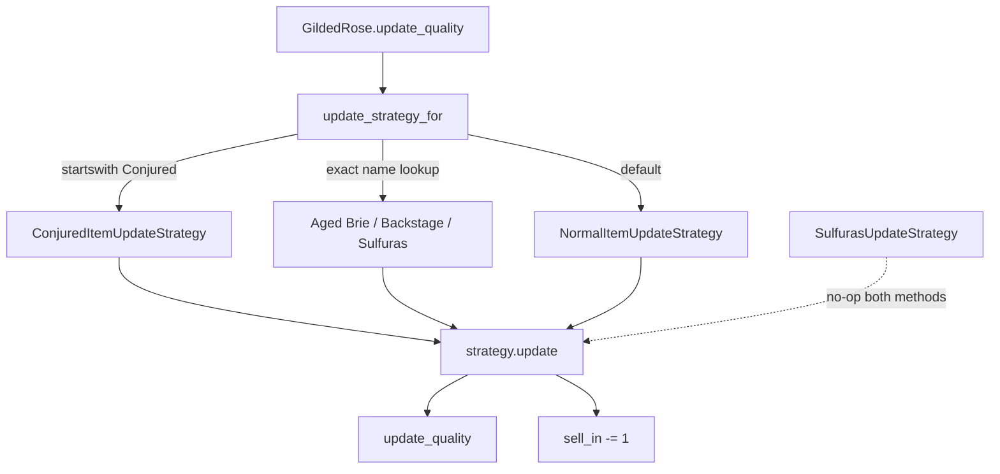

# Gilded Rose Kata — AI-Assisted Development Summary

**Candidate:** Eliza Papadopoulou  
**Language:** Python  
**Tool:** Cursor IDE (AI coding assistant / agent mode)  
**Period:** Aug 18–19, 2026  

---

## Assignment Context

Technical test completed with AI assistance, as encouraged by the interviewer. The goal was not only the final code, but also to show how AI was guided, validated, and reviewed.

Key constraints from [GildedRoseRequirements.md](../GildedRoseRequirements.md):

- Refactor the existing, functionally correct implementation
- Add **Conjured** items (degrade twice as fast as normal items)
- **Do not alter the `Item` class**
- Where requirements are ambiguous, treat the existing implementation as authoritative

---

## How I Worked With AI

| Practice | What I did |
|----------|------------|
| Test-first | Asked for unit tests before any production code changes |
| Iterative steering | Rejected fixtures, factories, and Item subclasses; gave precise constraints until tests matched my intent |
| Validation | Ran pytest, TextTest, and ApprovalTests; questioned unexpected results |
| Design review | Challenged AI on Strategy vs inheritance, Sulfuras no-ops, and Conjured name matching |
| Correction | Fixed wrong AI advice (e.g. removing `SulfurasUpdateStrategy.update_quality()`) |

---

## Session Highlights

Condensed from 9 Cursor agent sessions. Tool calls, patch details, and repeated prompts are omitted.

### 1. Environment setup (Aug 18)

**Me:** Set up venv, fix IDE import error for `approvaltests`, follow the README.

**AI:** Created `python/venv`, pointed IDE at it via `.vscode/settings.json` and `pyrightconfig.json`. Confirmed package was installed — the issue was the wrong Python interpreter.

**Outcome:** Environment working. Approval test still needs reporter config (separate issue).

---

### 2. Test planning (Aug 18)

**Me:** Write unit tests for every spec rule before refactoring. Iterated on test style:

- First asked for fixtures, then specific fixtures per item type
- Rejected fixture-based tests — wanted `@pytest.mark.parametrize` with visible `Item` construction
- Final instruction: no fixtures/factories; parametrize inputs and expected outputs; characterization tests must pass; only Conjured tests should fail; do not change production code

**AI:** Produced a test plan, then implemented 25 parametrized pytest tests in `test_gilded_rose.py`.

**Outcome:** 23 passed, 2 Conjured failures (expected). Commit: `5129c09`.

---

### 3. Design before refactor (Aug 18)

**Me:** Can I add `update_quality()` to `Item` and use subclasses?

**AI:** No — spec says do not alter `Item`. Use Strategy pattern with separate updater classes instead.

**Me:** Does the original code meet the spec?

**AI:** Mostly yes, except Conjured items are treated as normal items.

**Outcome:** Confirmed test-first approach and chose Strategy over inheritance.

---

### 4. Refactoring (Aug 18–19)

**Me:** Refactor using Strategy pattern.

**AI:** Replaced nested if/else in `gilded_rose.py` with `ItemUpdateStrategy` + 5 concrete strategies, `STRATEGIES_BY_NAME`, and `update_strategy_for()`. `Item` unchanged.

**Me:** Why `startswith("Conjured")` instead of a dict key?

**AI:** Matches `"Conjured Mana Cake"` in the fixture; Conjured is a category, not a fixed product name.

**Me:** Run TextTest regression tests.

**AI:** Switched `texttests/config.gr` to Python. TextTest failed on Conjured (golden master had old behavior). Removed Conjured strategy temporarily so refactor preserved existing behavior. TextTest passed.

**Outcome:** Clean refactor committed (`a828f0a`). Conjured deferred to next step.

---

### 5. Design review (Aug 19)

**Me:** Was Strategy the right choice? Should `SulfurasUpdateStrategy.update_quality()` be removed?

**AI:** Strategy is appropriate. Suggested removing redundant `update_quality()` on Sulfuras.

**Me:** No — Sulfuras must explicitly no-op on `update_quality()` too, or a direct call could raise `NotImplementedError` or behave wrongly.

**AI:** Agreed. Both `update()` and `update_quality()` should be explicit no-ops for Sulfuras.

**Outcome:** Safer interface design kept in final code.

---

### 6. ApprovalTests debugging (Aug 19)

**Me:** Explain approval tests. Why is `approved.txt` empty? Why does renaming it and re-running do nothing?

**AI:** ApprovalTests compares full fixture output to a golden master file. First run creates `received.txt`; you approve by renaming to `approved.txt`. Running the test file directly with `python` does not invoke pytest — use `pytest` instead.

**Me:** Why do tests pass if Conjured is not supported?

**AI:** Two different test types:
- **Unit tests** check the spec → Conjured tests fail
- **Approval tests** check recorded behavior → pass because golden master was captured from old (wrong) Conjured behavior

**Outcome:** Updated approved file for correct Conjured output. Commits: `fba48ef`, `022a3d6`, `9fa5373`.

---

### 7. Conjured feature (Aug 19)

**Me:** Shared terminal output — unit tests pass, approval test fails.

**AI:** Expected. Code now produces correct Conjured values; approved file still has old ones. Fix by updating the golden master.

**Outcome:** `ConjuredItemUpdateStrategy` added (degrade by 2 before sell date, 4 after). All 25 unit tests pass.

---

## Key Prompts (Representative)

Short list of the most important instructions I gave. Full wording is preserved for the longest, most shaping prompts.

```
Write unit tests for gilded_rose.py covering all restrictions in GildedRoseRequirements.md.
Do not modify production code. Only Conjured tests should fail.
```

```
Revise the test plan: no fixtures. Keep Item construction visible in tests.
Use @pytest.mark.parametrize for sell_in, quality, expected sell_in, expected quality.
Separate characterization tests from Conjured tests. Run baseline before and after.
```

```
Does the spec mean I cannot change Item? I was thinking of subclasses with update_quality().
→ Led to Strategy pattern instead.
```

```
Begin refactoring using the Strategy pattern for different item update rules.
```

```
Why startswith("Conjured") and not a dict key?
→ Questioned AI assumption; kept after understanding fixture data.
```

```
Use TextTest regression tests. Defer Conjured until existing behavior is preserved.
```

```
Sulfuras must explicitly no-op update_quality(), not inherit NotImplementedError.
→ I corrected the AI's suggestion to remove the method.
```

```
Why do tests pass if Conjured is not supported?
→ Led to understanding approval vs unit test difference.
```

---

## Work Summary

### Phase 1 — Environment
- Python venv, IDE config, README walkthrough

### Phase 2 — Unit tests (no production changes)
- **25 parametrized pytest tests** in `tests/test_gilded_rose.py`
- Commit `5129c09`

| Test | Cases |
|------|-------|
| `test_normal_item_degrades` | 5 |
| `test_aged_brie_increases_in_quality` | 5 |
| `test_backstage_passes_increase_in_quality_before_concert` | 6 |
| `test_backstage_passes_drop_to_zero_after_concert` | 2 |
| `test_sulfuras_never_changes` | 3 |
| `test_conjured_item_degrades_twice_as_fast` | 4 |

### Phase 3 — Strategy refactor
- `ItemUpdateStrategy` + 5 concrete strategies
- `STRATEGIES_BY_NAME` + `update_strategy_for()` factory
- `Item` class unchanged
- Commit `a828f0a`

| Decision | Choice |
|----------|--------|
| Subclass `Item`? | No |
| Pattern | Strategy + Template Method |
| Conjured matching | `item.name.startswith("Conjured")` |
| Sulfuras | Explicit no-op on `update()` and `update_quality()` |

### Phase 4 — Conjured + approval tests
- `ConjuredItemUpdateStrategy` added
- Approval golden master updated
- TextTest configured for Python
- Commits `fba48ef`, `022a3d6`, `9fa5373`

---

## Architecture



---

## Current State

| Area | Status |
|------|--------|
| Unit tests | 25 — all pass with Conjured |
| Strategy refactor | Committed |
| Conjured support | Implemented |
| Approval test | Golden master updated |
| TextTest | Configured for Python |

---

## Git History (AI-assisted)

```
5129c09  phase 1 complete. Added comprehensive unit tests (python). Production code not altered
cba9ed5  Add configuration for Black, isort, and Ruff in pyproject.toml
a828f0a  Refactor Gilded Rose item update logic by implementing strategy pattern
fba48ef  configure approvaltests
022a3d6  reviewed approvaltests and fixed conjured
9fa5373  corrected approvalstest output
```

---

## Other Artefacts

| Artefact | Location |
|----------|----------|
| Test implementation plan | `.cursor/plans/gilded_rose_unit_tests_67856690.plan.md` |
| IDE config | `.vscode/settings.json`, `pyrightconfig.json` |
| Linting | `pyproject.toml` |

Raw Cursor session logs (JSONL) remain in the local Cursor data folder if needed for the interview.
