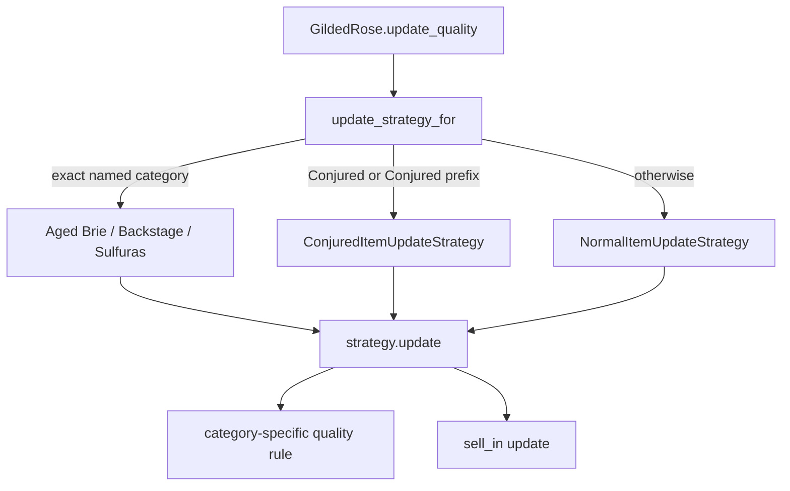

# Gilded Rose Kata — AI-Assisted Development Summary

**Candidate:** Eliza Papadopoulou
**Language:** Python
**Tool:** Cursor IDE (AI coding assistant / agent mode)
**Period:** 18–19 August 2026

## Assignment context

The exercise asked me to refactor the functionally correct legacy implementation, preserve its existing behaviour, and add support for Conjured items. AI use was explicitly encouraged, with emphasis on how its output was directed, validated, and reviewed.

The constraints that most influenced my approach were:

- do not alter the `Item` class or the `items` property;
- treat the existing implementation as authoritative where requirements are ambiguous;
- preserve existing behaviour during refactoring;
- add Conjured behaviour as a separate feature.

## How I worked with AI

| Practice | What I did |
|---|---|
| Test first | Added focused tests before modifying production code |
| Iterative steering | Revised my own fixture request after reviewing the unnecessary indirection it produced |
| Behavioural validation | Used focused unit tests plus approval-style regression tests |
| Scope control | Separated the behaviour-preserving refactor from the Conjured feature |
| Design review | Challenged suggestions involving `Item`, Sulfuras no-ops, and item-name matching |
| Output review | Inspected changed golden-master output rather than approving it blindly |

## Development process

### 1. Test planning

My initial prompt asked Cursor to test every rule in the specification while following the existing test conventions. Cursor identified that the starter test used `unittest`, while pytest was already available, and I chose pytest for its readable parameterization.

I initially requested fixtures, then reviewed the proposed structure and concluded that they obscured relevant inputs. I revised the instruction to:

- construct `Item` directly in each test;
- parameterize meaningful values such as initial `sell_in`, initial quality, and expected results;
- parameterize only cases expressing the same business rule;
- keep existing categories separate;
- keep Conjured tests separate and expected to fail before implementation;
- leave production code unchanged.

This interaction is retained because it demonstrates correction of my own earlier direction after reviewing the AI-generated design.

### 2. Characterization and feature tests

Cursor implemented 25 pytest cases covering:

| Behaviour | Cases |
|---|---:|
| Normal-item degradation and quality floor | 5 |
| Aged Brie increases and quality cap | 5 |
| Backstage threshold changes and cap | 6 |
| Backstage expiry | 2 |
| Sulfuras invariance | 3 |
| Conjured degradation and quality floor | 4 |

Before Conjured was implemented, 23 cases passed and the two distinguishing Conjured cases failed as expected. The other two Conjured boundary cases reached zero under both normal and Conjured degradation.

Tests were committed before production changes in `5129c09`.

### 3. Design choice

I considered adding behaviour to `Item` and using subclasses, then checked the restriction with Cursor. The conclusion was that changing or subclassing `Item` would conflict with the stated ownership constraint and could require callers to construct different types.

I chose separate update strategies wrapping the existing `Item` objects. The resulting design combines:

- Strategy for category-specific update rules;
- a small Template Method in `ItemUpdateStrategy.update()` for the common sequence;
- centralized selection in `update_strategy_for()`.

I retained explicit no-op implementations of both `update()` and `update_quality()` for Sulfuras. This keeps the concrete strategy behaviour correct even if `update_quality()` is called directly in future code.

### 4. Behaviour-preserving refactor

Cursor initially introduced the strategy structure together with Conjured support. When the regression output showed Conjured as the only behavioural difference, I separated the work:

1. temporarily remove Conjured support;
2. verify that the refactor preserves existing output;
3. commit the refactor independently;
4. add Conjured afterward as a feature.

The behaviour-preserving refactor introduced four concrete strategies for the existing categories and was committed in `a828f0a`. The `Item` class remained unchanged.

### 5. Approval and regression testing

The repository contains two broad-output regression mechanisms in addition to the focused unit tests:

- ApprovalTests.Python captures the 30-day fixture output in pytest;
- TextTest runs the same fixture and compares it with its saved output.

Cursor helped explain the received/approved workflow, but I reviewed the differences before accepting new output. This exposed an important distinction:

- characterization output records existing behaviour;
- Conjured tests express the new required behaviour.

The approved Conjured output was prepared in `022a3d6` and corrected in `9fa5373`. The production feature followed in a separate commit.

### 6. Conjured feature

`ConjuredItemUpdateStrategy` was added in `546046b`:

- quality decreases by 2 before the sell-by date;
- quality decreases by 4 on or after the sell-by date;
- quality does not fall below zero.

The TextTest golden master was updated in `bacbb6d` after reviewing the expected Conjured-only changes.

The matching rule was subsequently tightened so that only the exact name `"Conjured"` or names beginning with `"Conjured "` use the strategy. This supports Conjured as a category without classifying unrelated names such as `"Conjuredness"`.

## Representative prompts

```text
Write unit tests for gilded_rose.py covering all restrictions in
GildedRoseRequirements.md. Do not modify production code.
Only Conjured tests should fail.
```

```text
Revise the test plan: no fixtures. Keep Item construction visible in tests.
Use @pytest.mark.parametrize for sell_in, quality, expected sell_in, and
expected quality. Separate characterization tests from Conjured tests.
```

```text
Does the specification mean I cannot change Item? I was thinking of
subclasses with update_quality().
```

```text
Use the TextTest regression tests. Keep this stage as a behaviour-preserving
refactor and add Conjured afterward.
```

```text
Sulfuras must explicitly no-op update_quality(), rather than inherit
NotImplementedError.
```

```text
Why do the tests pass if Conjured is not supported?
```

## Final architecture



## Current state

| Area | Status |
|---|---|
| Focused unit-test cases | 25 passing |
| Existing behaviour | Protected by unit and regression tests |
| Strategy refactor | Complete |
| Conjured support | Complete |
| `Item` class | Unchanged |
| Approval output | Updated after review |
| TextTest output | Updated after review |
| Formatting and linting configuration | Included in `pyproject.toml` |

## Relevant Git history

```text
5129c09  Add comprehensive Python unit tests without changing production code
cba9ed5  Configure Black, isort, and Ruff
fba48ef  Configure approval tests
a828f0a  Refactor item updates using Strategy
022a3d6  Review and update approved Conjured output
9fa5373  Correct approved output
546046b  Add ConjuredItemUpdateStrategy
6ede1e8  Add formatting tools and tighten project hygiene
bacbb6d  Update TextTest output for Conjured behaviour
143db48  Refine Conjured item-name matching
2c805e4  Add selected AI transcripts
c224998  Curate the strategy transcript
```

The descriptions above summarize the purpose of each commit; the repository retains the original commit messages.

## Submitted AI artefacts

| Artefact | Location |
|---|---|
| Initial test plan | `.cursor/plans/gilded_rose_unit_tests_67856690.plan.md` |
| Test-planning transcript | `python/transcripts/cursor_1_unit_tests_for_gilded_rose.md` |
| Test-implementation transcript | `python/transcripts/cursor_unit_tests_for_gilded_rose.md` |
| Strategy and design-review transcript | `python/transcripts/cursor_1_item_class_update_strategy.md` |
| Conjured and approval-debugging transcript | `python/transcripts/cursor_conjured_support_test_results.md` |
| Formatting and linting configuration | `python/pyproject.toml` |

The four transcripts are selected exports from the relevant Cursor sessions. The strategy transcript explicitly notes that later unrelated or duplicated discussion was omitted; the retained dialogue is otherwise unchanged. No custom agent steering files or skills were used.
